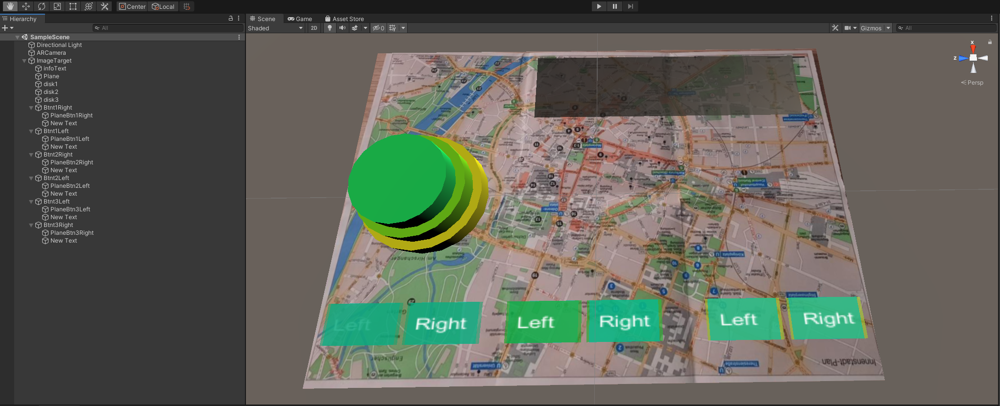

# Augmented Reality Tower of Hanoi in Unity with Vuforia

## Installation Setup
1) Install Unity
2) Add Vuforia Engine to the Unity installation ([Vuforia](https://developer.vuforia.com/downloads/sdk))

## Vuforia Setup
1) Create a Vuforia License ([License](https://developer.vuforia.com/vui/develop/licenses))
2) Add a Target to the Vuforia Targetmanager ([Targetmanager](https://developer.vuforia.com/vui/develop/databases)) and Download the Database

## Unity Setup
1) Add your Vuforia License to Unity 
2) Create a new AR Camera
3) Add a new ImageTarget. Select here your Image of the downloaded Database  
4) Add 3 GameObjects (Disk 1-3) and place them where you want the start tower to be
5) Add 6 virtual Buttons and a Text and Plane on top of the Button
6) Add the two scripts GameHandler.cs and Tower.cs to your unity Project and the GameHandler.cs script to the ImageTarget
7) Drag and Drop the 3 Gameobjects, 6 Virtual Buttions ans optinal the Textfield to the GameHandler.cs script Public inputs
*Optional:*
8) Add a plane and a textfield

*For Step 4 - 6 you can also download the Assets folder instead and paste it in you projects Assets folder*  

In Unity your workspace should look like in the following Image:

# Result:
Play with the Virtual Buttons:

Play with the mouse and raycasting:

A
